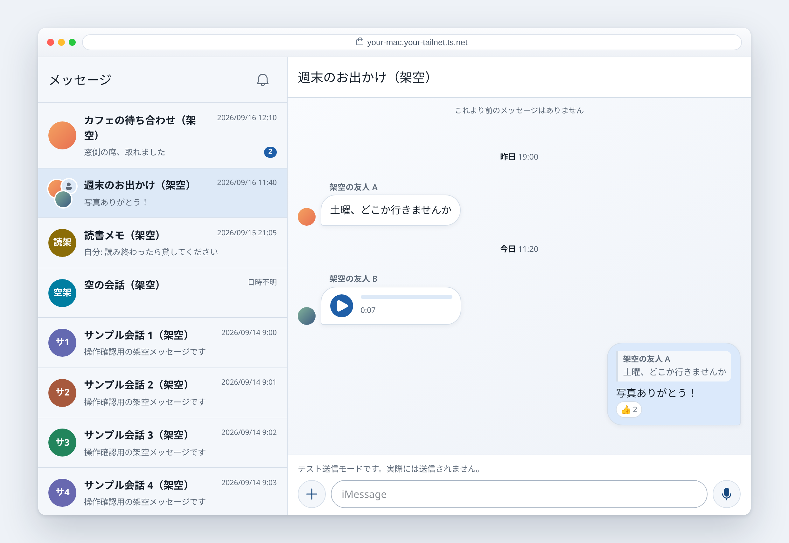
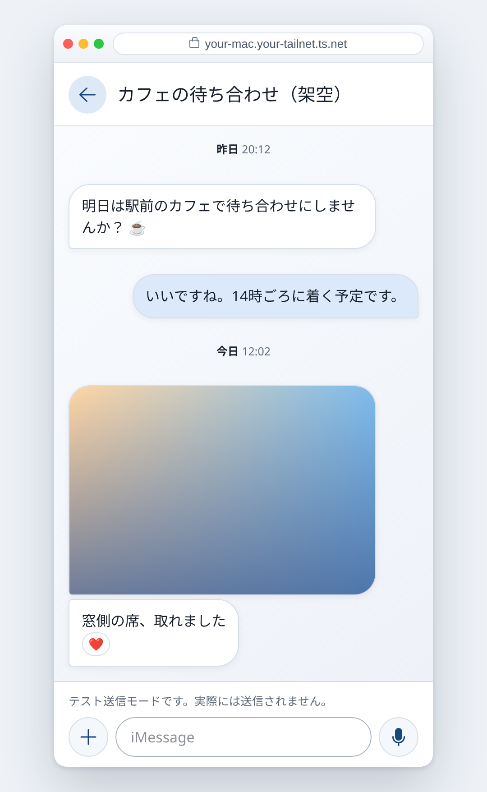

# imsg-web

**English** · [日本語](README_ja.md)

Read and send your iMessages from a browser, served by your own Mac.

It is a small web UI over the [`imsg`](https://github.com/openclaw/imsg) CLI: your
Mac keeps the messages, a local server reads them, and you reach that server over
your own [Tailscale](https://tailscale.com) network from a phone or another
computer. Nothing is mirrored anywhere, and nothing is exposed to the public
Internet.

It is built for **one person on their own Mac**.

<p align="center">
  
  <br><br>
  
</p>

<p align="center"><sub>Everything above is synthetic — from the preview in <code>scripts/demo-preview.mjs</code>.
Nothing in it was in anyone's conversation.</sub></p>

## Features

- **Conversations and history**, refreshed every 15 seconds, opening at the
  newest message and paging as you scroll
- **Pictures**, including Messages' cached thumbnail when the full image was
  never downloaded; click one to open it, with pinch and wheel zoom
- **Voice messages**, played in place
- **Contact pictures**, and a group wearing its members' faces
- **Replies and tapbacks**, with the quote as a way back to the message answered
- **Link cards**, from the preview Messages already stored
- **Sending** text, files and voice recordings you make in the browser
- **Notifications** for new messages, once you turn them on

Not supported: sending a reply or a tapback, read receipts, typing indicators,
search. The first two need imsg's bridge, which wants SIP disabled and code
injected into Messages; this project does not go there.

## What you need

- **A Mac** that is signed into Messages and stays awake. Everything runs there.
- **`imsg`, built with the patches in [`imsg-patches/`](imsg-patches/)** — four
  small changes upstream does not carry. That directory says what and how.
- **Node 24**, unpacked somewhere of its own. Not the system one: this copy gets
  Full Disk Access.
- **Tailscale**, or another private way to reach the Mac.

## Setting it up

```sh
git clone https://github.com/MoomA-0750/imsg-web && cd imsg-web
npm ci --ignore-scripts
npm run build

./scripts/install.sh \
  --imsg /path/to/patched/imsg \
  --node /path/to/node-v24.20.0-darwin-arm64 \
  --origin https://your-mac.your-tailnet.ts.net
```

It lays out a private directory under `~/Library/Application Support/imsg-web`,
installs the build, asks you for a password, and starts a LaunchAgent. Run the
same command again after `npm run build` to install a new release; the previous
one stays as the way back.

Two things it will tell you to do yourself:

- **Full Disk Access** for the Node binary it installed (System Settings →
  Privacy & Security). macOS holds *that* binary responsible for reading
  `chat.db`, not your terminal.
- **`tailscale serve --bg 8787`**, so the address you gave it reaches the Mac.

Then open that address and sign in.

## Using it

- **Send** with the round button, or Ctrl+Enter / ⌘+Enter. There is no
  confirmation step.
- **Record** with the microphone, which is where the send button is when there is
  nothing to send. What you record waits with the other attachments until you
  send it.
- **Attach** with `＋`. Several files go as several messages.
- **Open a picture** by clicking it; wheel, pinch or double click to zoom, and
  pull it down to close.
- **Jump to what a reply answers** by pressing its quote.
- **See the time of every message** by dragging the conversation to the left.
- **Turn on notifications** with the bell beside メッセージ.

Sending is on by default. `./scripts/install.sh --send off` turns it off, and
`--send dry-run` validates everything without dispatching.

## Development

Put a dedicated Node **24.20.0** first in `PATH`, then:

```sh
npm ci --ignore-scripts
npm run typecheck
npm test
npm run build
npm run test:browser     # synthetic HTTPS, Chromium
```

Tests use synthetic data only and never run a real `imsg`. There is no fixture
anywhere in this repository that came from a real conversation.

`node scripts/demo-preview.mjs <tailscale-ip> 18787` runs the whole UI on made-up
data, which is a good way to see it before installing anything.

## More

- [`docs/security.md`](docs/security.md) — how it is kept safe, and what it is not defended against
- [`docs/behaviour.md`](docs/behaviour.md) — what the screen does not say: why a row is blank, why an image is missing, what a failed send means
- [`docs/operations.md`](docs/operations.md) — install, LaunchAgent, Serve, stop, update, and what to do when a send fails
- [`docs/architecture.md`](docs/architecture.md) — the read-only RPC contract, and how attachments, faces and audio are handled
- [`docs/real-data-findings.md`](docs/real-data-findings.md) — what real data proved, and disproved, about Messages' own storage
- [`imsg-patches/`](imsg-patches/) — the four patches, and how to build imsg with them

## Licence

MIT. See [LICENSE](LICENSE). `imsg` itself is MIT, © Peter Steinberger; the
patches here are changes to that source and carry its licence.
